# 🧠 Brain Tumor Detection using Deep Learning

<p align="center">


</p>

<p align="center">


</p>

---

# 📌 Project Overview

Brain Tumor Detection using Deep Learning is a complete **end-to-end Artificial Intelligence web application** developed to classify brain MRI scans into four categories using a **Custom Convolutional Neural Network (Custom CNN)**.

The project combines **Machine Learning**, **Computer Vision**, **FastAPI**, **React**, and **Supabase** to deliver an intelligent medical imaging solution capable of performing real-time brain tumor prediction through an interactive web interface.

This project demonstrates the complete lifecycle of an AI application, including:

- Dataset Analysis
- Data Preprocessing
- Deep Learning Model Development
- Model Evaluation
- REST API Development
- Modern React Frontend
- Database Integration
- Prediction History
- Dashboard Analytics
- PDF Report Generation

---
## 📚 Dataset

This project uses the **Brain Tumor MRI Dataset** publicly available on Kaggle.

### Dataset Information

- **Dataset Name:** Brain Tumor MRI Dataset
- **Source:** Kaggle
- **Author:** Mohibur Rahman Rifat
- **Classes:**
  - Glioma
  - Meningioma
  - Pituitary
  - No Tumor

### Dataset Link

🔗 https://www.kaggle.com/datasets/mohiburrahmanrifat/brain-tumor-mri

> **Note:** The dataset is not included in this repository due to its size and Kaggle's distribution policy. Please download it from the official Kaggle page and place it inside the `dataset/` directory before running the project.

# 🎯 Objectives

The primary objectives of this project are:

- Detect brain tumors from MRI images using Deep Learning.
- Build a complete AI-powered medical imaging application.
- Develop a responsive frontend for real-time prediction.
- Integrate FastAPI for serving AI predictions.
- Store prediction history using Supabase.
- Visualize prediction statistics through dashboards.
- Generate downloadable PDF prediction reports.
- Create a production-ready AI project suitable for deployment.

---

# 🧬 Brain Tumor Classes

| Class | Description |
|--------|-------------|
| 🧠 Glioma | Tumor originating from glial cells in the brain |
| 🧠 Meningioma | Tumor arising from the meninges surrounding the brain |
| 🧠 Pituitary | Tumor affecting the pituitary gland |
| ✅ No Tumor | Healthy brain MRI without tumor |

---

# ✨ Features

### 🤖 Artificial Intelligence

- ✅ Custom CNN Brain Tumor Classifier
- ✅ MRI Image Classification
- ✅ Multi-Class Prediction
- ✅ Confidence Score
- ✅ AI Generated Explanation
- ✅ Medical Recommendation

---

### 🌐 Web Application

- ✅ Modern React Frontend
- ✅ FastAPI REST Backend
- ✅ Responsive UI
- ✅ Dark Mode
- ✅ MRI Image Upload
- ✅ Drag & Drop Support
- ✅ Real-Time Prediction

---

### 📊 Dashboard

- ✅ Prediction History
- ✅ Dashboard Analytics
- ✅ Tumor Statistics
- ✅ Charts & Graphs
- ✅ Model Performance Page

---

### 🗄 Database

- ✅ Supabase Integration
- ✅ Prediction Storage
- ✅ Automatic History Logging

---

### 📄 Reports

- ✅ PDF Report Generation
- ✅ Download Prediction Report
- ✅ Confidence Report
- ✅ AI Explanation Report

---

# 🏥 Application Workflow

```text
                     Brain MRI Scan
                            │
                            ▼
                  Upload through React UI
                            │
                            ▼
                  FastAPI Prediction API
                            │
                            ▼
              Image Preprocessing (224×224)
                            │
                            ▼
               Custom CNN Deep Learning Model
                            │
                            ▼
          Tumor Prediction + Confidence Score
                            │
                            ▼
             AI Explanation & Recommendation
                            │
                            ▼
             Store Prediction in Supabase
                            │
                            ▼
      Dashboard • History • PDF Report • Analytics
```

---

# 📸 Application Screenshots

## 🏠 Home Page & Upload Page

<table>
<tr>
<td align="center">

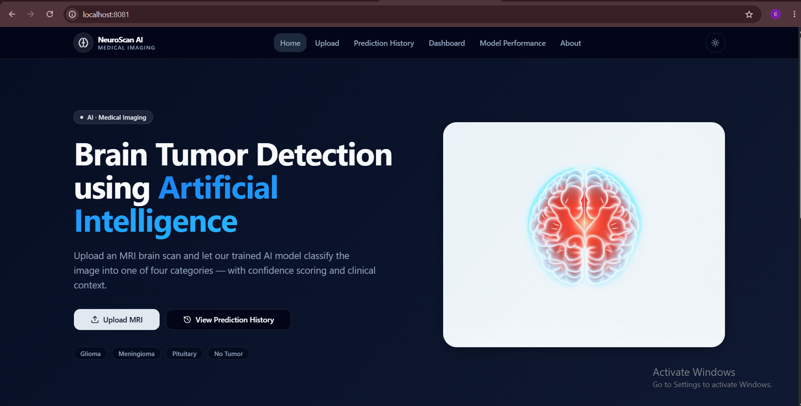

<b>Home Page</b>

</td>

<td align="center">

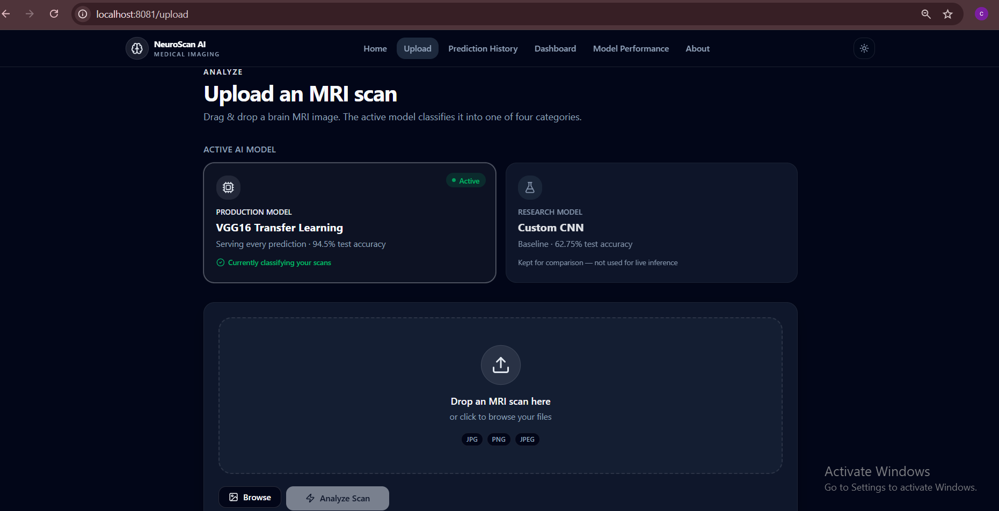

<b>Upload MRI</b>

</td>

</tr>
</table>

---

## 🧠 Prediction Results

<table>

<tr>

<td align="center">

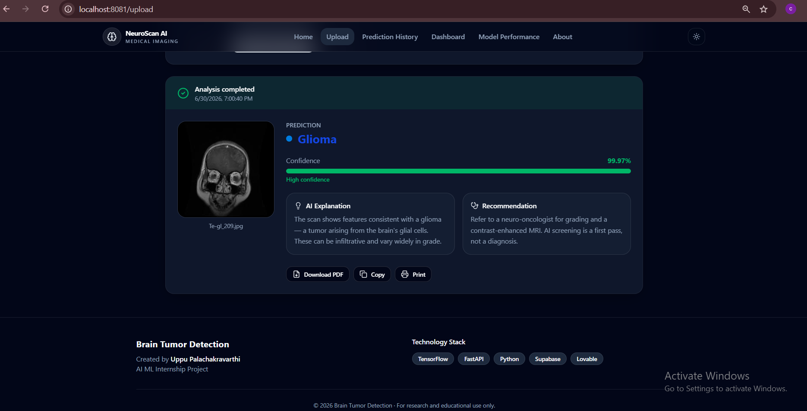

<b>Glioma Prediction</b>

</td>

<td align="center">

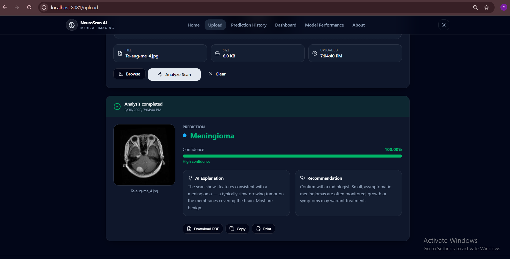

<b>Meningioma Prediction</b>

</td>

</tr>

<tr>

<td align="center">

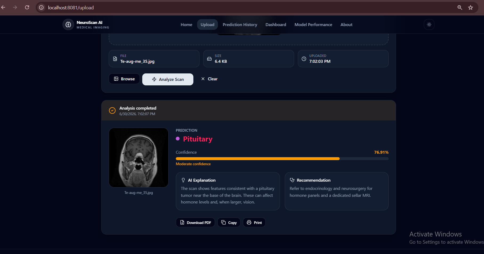

<b>Pituitary Prediction</b>

</td>

<td align="center">

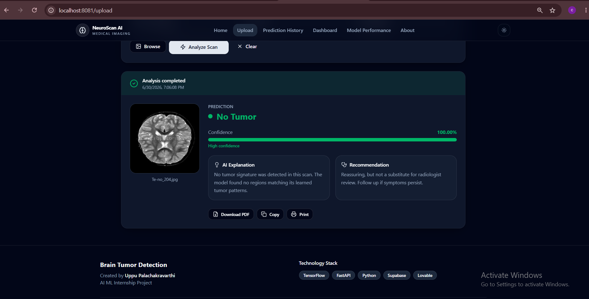

<b>No Tumor Prediction</b>

</td>

</tr>

</table>

---

## 📊 Dashboard & Prediction History

<table>

<tr>

<td align="center">

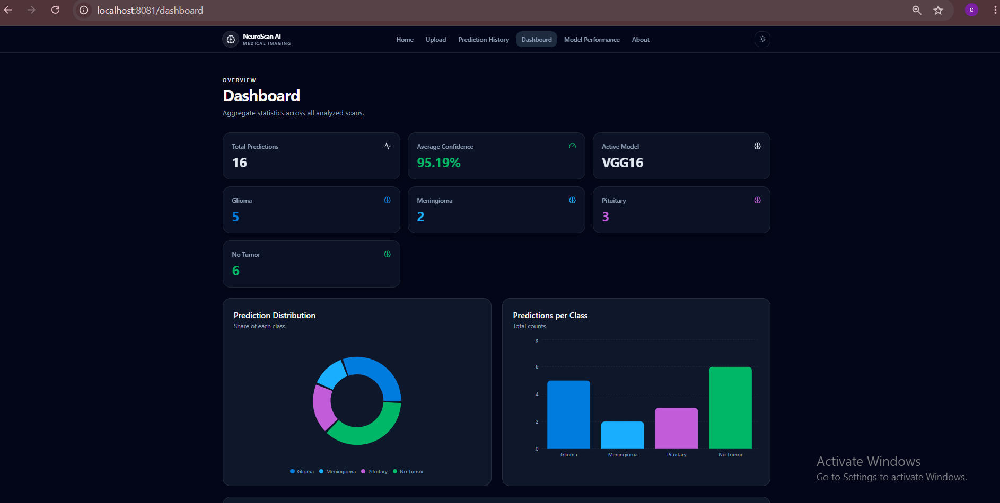

<b>Dashboard</b>

</td>

<td align="center">

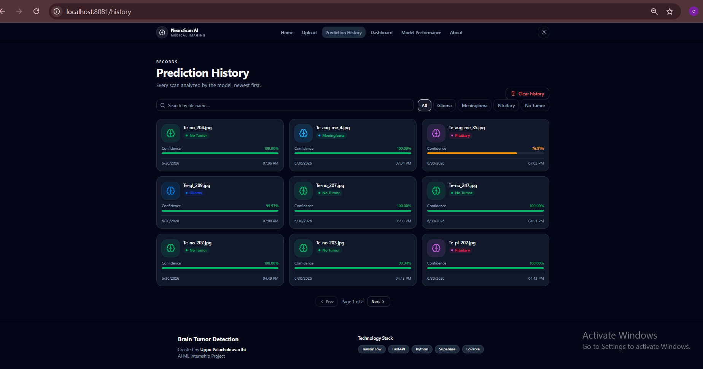

<b>Prediction History</b>

</td>

</tr>

</table>

---

## 📈 Model Performance & PDF Report

<table>

<tr>

<td align="center">

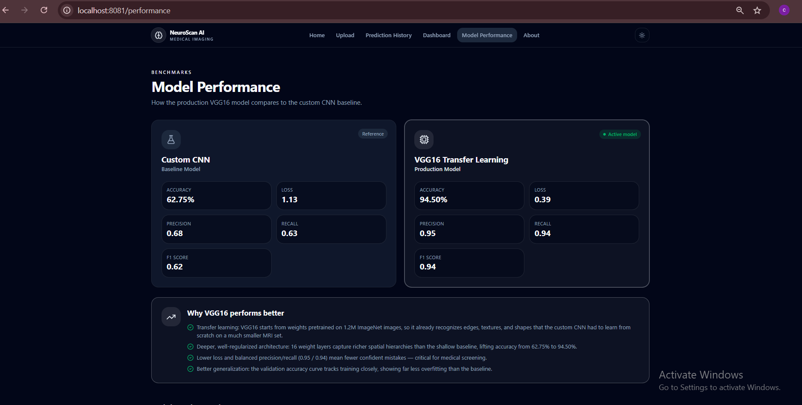

<b>Model Performance</b>

</td>

<td align="center">

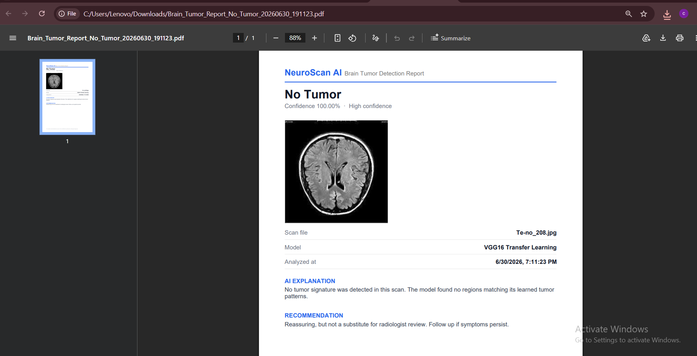

<b>Generated PDF Report</b>

</td>

</tr>

</table>

---

# ⭐ Project Highlights

- 🧠 End-to-End AI Web Application
- 🤖 Deep Learning based Brain MRI Classification
- 🌐 Modern React + TypeScript Frontend
- ⚡ FastAPI REST API Backend
- 🗄 Supabase Database Integration
- 📊 Interactive Dashboard
- 📜 Prediction History
- 📄 PDF Report Generation
- 🌙 Dark Mode Support
- 📱 Fully Responsive Design
- 🚀 Production Ready Architecture

---
# 📂 Project Structure

```text
BrainTumorProject
│
├── .vscode/
│
├── app/
│   ├── __init__.py
│   ├── config.py
│   ├── main.py
│   ├── predict.py
│   ├── routes.py
│   └── supabase_client.py
│
├── dataset/
│   ├── Training/
│   ├── Testing/
│   └── Validation/
│
├── docs/
│
├── frontend/
│   └── brain-tumor/
│       ├── src/
│       │   ├── assets/
│       │   ├── components/
│       │   │   ├── brain/
│       │   │   └── ui/
│       │   ├── hooks/
│       │   ├── lib/
│       │   ├── routes/
│       │   ├── router.tsx
│       │   ├── routeTree.gen.ts
│       │   ├── server.ts
│       │   ├── start.ts
│       │   └── styles.css
│       │
│       ├── package.json
│       ├── vite.config.ts
│       ├── components.json
│       └── tsconfig.json
│
├── models/
│   ├── custom_cnn.py
│   ├── custom_cnn.keras
│   ├── custom_cnn_final.keras
│   ├── vgg16_model.py
│   ├── vgg16_finetuned.keras
│   └── best_vgg.keras
│
├── notebooks/
│   └── VGG16.ipynb
│
├── outputs/
│   ├── accuracy.png
│   ├── loss.png
│   ├── class_distribution.png
│   ├── sample_mri_images.png
│   ├── augmented_images.png
│   ├── custom_cnn_confusion_matrix.png
│   ├── vgg16_accuracy.png
│   ├── vgg16_loss.png
│   └── vgg16_confusion_matrix.png
│
├── scripts/
│   ├── dataset_analysis.py
│   ├── train.py
│   └── preprocess.py
│
├── requirements.txt
├── README.md
└── LICENSE
```

---

# 🛠️ Technology Stack

<p align="center">


</p>

---
## 🧠 Deep Learning Models

This project implements and compares two deep learning models for multi-class Brain MRI tumor classification.

| Model | Accuracy | Precision | Recall | F1-Score | Status |
|-------|---------:|----------:|--------:|---------:|--------|
| Custom CNN | 62.75% | 68% | 63% | 62% | 📊 Baseline Model |
| VGG16 Transfer Learning | 94.50% | 95% | 94% | 94% | ✅ Final Model |

---

## 🏆 Final Model Selection

The **VGG16 Transfer Learning** model was selected as the final model because it significantly outperformed the Custom CNN across all evaluation metrics.

### Model Comparison

| Metric | Custom CNN | VGG16 |
|--------|-----------:|-------:|
| Accuracy | **62.75%** | **94.50%** |
| Loss | **1.1326** | **0.3915** |
| Precision | **68%** | **95%** |
| Recall | **63%** | **94%** |
| F1-Score | **62%** | **94%** |

### Why VGG16?

- ✅ Highest Accuracy (94.50%)
- ✅ Lowest Loss (0.3915)
- ✅ Excellent Precision, Recall, and F1-Score
- ✅ Strong performance across all four tumor classes
- ✅ Selected as the production model for Brain MRI classification

<p align="center">


</p>

> **Final Deployed Model:** 🧠 **VGG16 Transfer Learning**

# 🏥 Tumor Categories

| Class | Description |
|-------|-------------|
| Glioma | Tumor arising from glial cells |
| Meningioma | Tumor originating from meninges |
| Pituitary | Tumor affecting pituitary gland |
| No Tumor | Healthy MRI Scan |

---

# ⚙ Backend (FastAPI)

The backend is responsible for:

- Receiving uploaded MRI images
- Image preprocessing
- Loading trained CNN model
- Running prediction
- Returning confidence score
- Saving prediction history to Supabase

---

# 💻 Frontend (React)

The frontend includes:

- Modern Dark UI
- Home Page
- MRI Upload
- Prediction Results
- Prediction History
- Dashboard
- Model Performance
- About Page
- Download PDF Report
- Print Report
- Responsive Design

---

# 🗄 Database (Supabase)

Prediction records are automatically stored.

### Table: predictions

| Column | Description |
|---------|-------------|
| id | UUID |
| image_name | MRI filename |
| prediction | Predicted class |
| confidence | Prediction confidence |
| created_at | Timestamp |

---

# 🌐 Backend API

The FastAPI backend exposes REST APIs that power the web application.

Main functionalities include:

- Health Check
- MRI Image Upload
- Tumor Prediction
- AI Explanation
- Recommendation Generation
- Prediction History
- Dashboard Statistics
- Model Performance
- PDF Report Generation
- Supabase Data Storage

> Backend implemented using **FastAPI** with modular routing architecture.

---

# 🚀 Installation

## Clone Repository

```bash
git clone https://github.com/SunkesulaMasthan/MYONE.git

```

```bash
cd BrainTumorProject
```

---

## Create Python Environment

```bash
conda create -n braintumor python=3.11
```

```bash
conda activate braintumor
```

---

## Install Backend Dependencies

```bash
pip install -r requirements.txt
```

---

## Start Backend

```bash
uvicorn app.main:app --reload
```

Backend:

```
http://127.0.0.1:8000
```

---

## Frontend Setup

```bash
cd frontend/brain-tumor
```

Install packages

```bash
npm install
```

Run application

```bash
npm run dev
```

Frontend:

```
http://localhost:8081
```
---

# 🤝 Contributing

Contributions are welcome.

1. Fork the repository
2. Create a feature branch
3. Commit changes
4. Push changes
5. Create a Pull Request

---

# 👨‍💻 Author

**Sunkesula Masthan**

B.Tech Computer Science & Engineering(C S E)

AI • Machine Learning • Deep Learning

GitHub: https://github.com/SunkesulaMasthan

---

# 📜 License

This project is licensed under the MIT License.

---

<p align="center">
⭐ If you found this project useful, please consider giving it a star.
</p>

<td align="center">
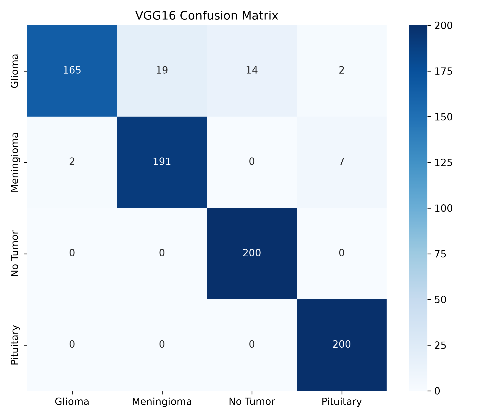<br>
<b>VGG16</b>
</td>
</tr>
</table>

---

